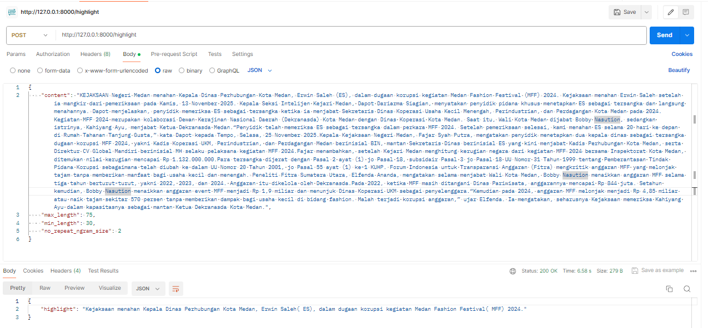

# Legal News Highlight API (IndoT5)

This repository contains an API for generating **highlight summaries of Indonesian legal news**
using **abstractive text summarization** based on the **IndoT5** model.
The API is built with **FastAPI** and designed to efficiently extract the core information
from long and complex legal news articles.

## Background
The rapid growth of online legal news has made it increasingly difficult for readers to
quickly identify relevant information due to long article lengths and complex legal language.
This condition contributes to low public legal awareness.
To address this issue, automatic text summarization is applied to generate concise
highlight summaries that help users understand the essence of legal news efficiently.

## Solution Overview
The proposed API implements **abstractive text summarization** using a fine-tuned **IndoT5**
model to generate short, coherent highlights from Indonesian legal news articles.
Users can control summary length and repetition constraints through configurable parameters.

## Technology Stack
- Python
- FastAPI
- Hugging Face Transformers
- IndoT5
- Uvicorn
- Postman

## API Endpoints

| Endpoint      | Method | Description |
|--------------|--------|-------------|
| `/health`    | GET    | Check API status |
| `/highlight` | POST   | Generate legal news highlight |

## Example Request
```json
{
  "content": "Full legal news article text",
  "max_length": 75,
  "min_length": 30,
  "no_repeat_ngram_size": 2
}
```

## Model Information

- **Base model**: IndoT5 (pre-trained)  
- **Fine-tuning data**: Indonesian legal news articles from Tempo  
- **Summarization type**: Abstractive  

Due to the large file size, the fine-tuned models are **not included** in this repository.
### Download Model Files
The fine-tuned models are provided as ZIP files via Google Drive:

🔗 **Model Download Link:**  https://drive.google.com/drive/folders/1YFpvlt7Sa-uVGad8ECpSLU7CrJNMBBnQ?usp=sharing

After downloading, extract the ZIP files and place them in the following directory structure:
```text
models/
 ├── finetuned_wikidepia/
 └── finetuned_cahya/
```

## Running the API Locally

Follow the steps below to run the API on a local environment.

### 1. Install Dependencies
Make sure Python is installed, then install all required packages:

```bash
pip install -r requirements.txt
```

### 2. Run the API Server
Start the FastAPI server using Uvicorn:

```bash
uvicorn app.main:app --reload
```

## API Testing

API testing was conducted using **Postman** to validate the functionality of the implemented endpoints,
including request handling, response structure, and summarization output.

### Highlight Endpoint Testing
The `/highlight` endpoint was tested by sending a **POST** request containing a legal news article
along with summarization parameters such as `max_length`, `min_length`, and `no_repeat_ngram_size`.
The API successfully processed the request and returned a highlight summary in JSON format.



The test results indicate that the API responds correctly with a **200 OK** status,
demonstrating that the summarization pipeline and API integration function as expected.

